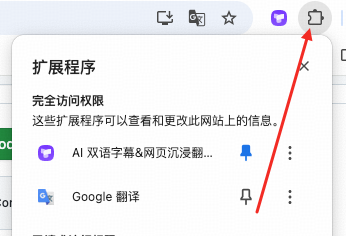
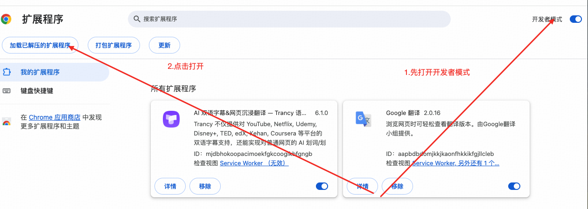
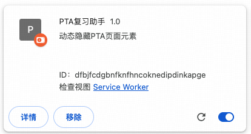
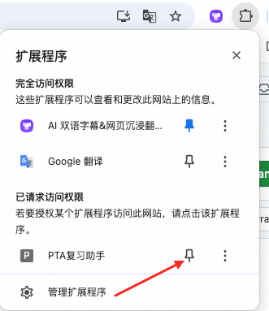

# 使用 pta 复习你是不是也很痛苦？

## PTA 复习助手

一个 Chrome 扩展，旨在帮助用户在 PTA (pintia.cn) 平台进行复习时，通过动态隐藏或显示页面上的关键元素，如单选按钮、多选按钮、结果区域和填空答案，来提升学习效率。

### 功能

- **隐藏/显示单选按钮**：在做题时隐藏单选题目选项，避免干扰。
- **隐藏/显示多选按钮**：在做题时隐藏多选题目选项。
- **隐藏/显示结果区域**：隐藏题目的解答和正确/错误提示。
- **隐藏/显示填空答案**：将填空题的输入框内容设置为透明，达到隐藏答案的效果。
- **过滤回答正确题目**：隐藏已经回答正确的题目，专注于错题和未做题目。
- **训练模式** (温馨提示：如 pta 提供了标准答案则答案来源标准答案，若未提供则来自用户上一次提交的答案，请注意自行点击更正答案进行答案更正)：
  - 在页面添加"提交答案"按钮。
  - 提交后，会弹窗显示错题详情（题号、题目内容、正确答案、你的答案）或提示全部正确。
- **导出做题答案 (文本)**：将当前页面的题目和（如果已填写）所选答案导出为文本格式。
- **导入做题答案 (文本)**：读取之前导出的文本格式答案，并自动填写到页面上对应的题目中。
- **导出题目数据 (JSON)**：将当前页面的题目数据（包括题目内容、选项、答案等）导出为 JSON 格式，方便进一步处理或分析。

### 下载链接

https://github.com/Dawson-web/PTA-Review-Plugin/archive/refs/tags/%E6%AD%A3%E5%BC%8F%E7%89%88V2.1.zip

### 安装步骤

### 注意事项

- 本扩展仅用于学习和复习，请勿用于考试作弊。
- 扩展主要适用于 PTA 平台 (pintia.cn) 的题目练习页面。
- 导出答案前，请确保需要导出的内容（如单选、多选、填空）是可见的，否则导出的对应部分也可能为空或不完整。
- 如果页面是通过动态加载方式显示新题目，扩展会自动将设置应用到新加载的元素上。
